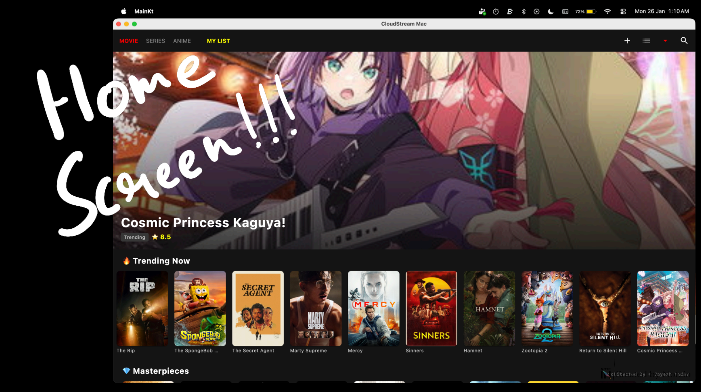
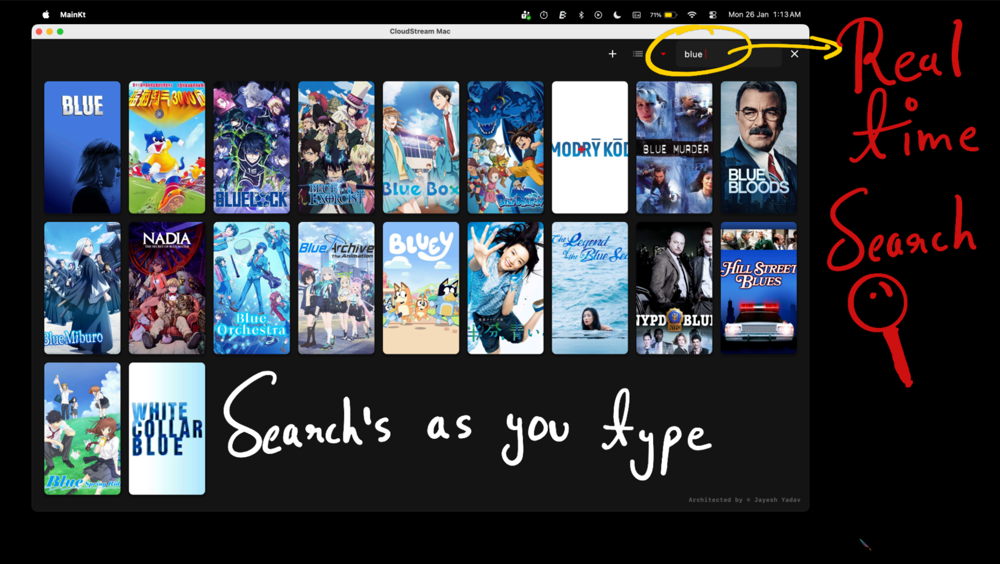
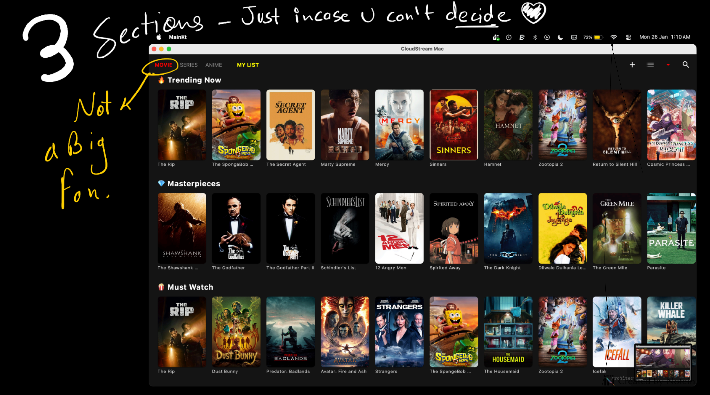

🎬 CloudStream
> ⚠️ This project operates in a legal gray area and is intended for educational purposes only.

A modular streaming engine built with Kotlin Multiplatform, designed around a plugin-based architecture and dynamic content pipelines.

✨ Overview

CloudStream is not just a streaming app.

It is an exploration of how streaming platforms can be built as extensible systems, where content sources, extraction logic, and playback are decoupled into modular components.

⸻

🖼️ Preview

Home Experience

Search & Discovery

Content details
  

Repositories and break point
[Repo](assets/7.png)  
Architecture and Mental Model
[MindMap](assets/mindmap.png)

🚀 Features
	•	Dynamic home screen with categorized content
	•	Real-time search (search-as-you-type)
	•	Favorites system with persistent storage
	•	Metadata integration (TMDB)
	•	Embedded video playback (VLCJ)
	•	Plugin-based content extraction
	•	Repository-based source management

⸻

🧠 Architecture

CloudStream is built as a modular system, not a monolithic app.

Core Flow
User → Repository → Plugin → Extraction → Playable Stream → Video Player

🧩 Plugin System
	•	Each content source is isolated
	•	Plugins define their own extraction logic
	•	Easily extendable without touching core code

📦 Repository System
	•	Dynamic plugin distribution
	•	Runtime import support
	•	Decouples content sources from application

⚙️ Extraction Pipeline
	•	Converts content pages into playable streams
	•	Handles multiple hosting providers
	•	Built for flexibility and resilience

🎥 Playback Layer
	•	Desktop implementation using VLCJ
	•	Embedded video playback inside Compose UI

  🏗️ Project Structure
  shared/
 ├── commonMain/     → Core logic (plugins, extraction, repositories)
 └── desktopMain/    → UI + VLCJ playback

 ⚙️ Development Journey

This project was built through multiple iterations and architectural pivots:
	•	Started as Android-first approach
	•	Shifted to Desktop-first for stability
	•	Dropped ChainTech player due to limitations
	•	Integrated VLCJ for reliable playback
	•	Resolved Gradle + KMP dependency conflicts
	•	Simplified platform targets to focus on core system

⚠️ Platform Strategy
	•	Desktop → Stable ✅
	•	Android → Planned
	•	iOS → Temporarily disabled

Reason:
Focus was placed on stabilizing the core system before expanding platform support.

▶️ Running the Project
git clone https://github.com/jaydev-ops/cloudstream.git
cd cloudstream
./gradlew run

🧪 Notes
	•	Includes a mock plugin used for testing the architecture
	•	API keys have been removed for security
	•	Built for learning, experimentation, and system design

  🧠 Key Takeaway
This project is not about streaming.
It is about:
Designing systems that are modular, extensible, and adaptable.

📄 License
This project is licensed under the terms of the MIT License.